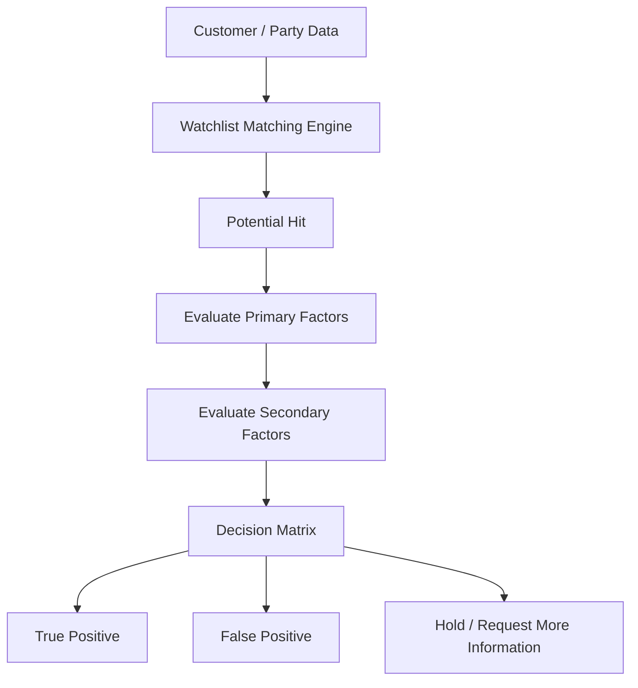

Below is a **clean Markdown version of the requirements**, without explanations or extra commentary. You can paste this directly into **Confluence, GitHub, Notion, or a PRD document**.

---

# Name Screening System – Functional Requirements

## 1. Objective

Develop a **Name Screening System** to evaluate potential matches between customer data and external watchlists (e.g., Dow Jones, sanctions lists, MAS lists).

The system must determine whether a match is:

* **True Positive**
* **False Positive**
* **Hold (Insufficient Information)**

The decision must be based on evaluation of **Primary Factors** and **Secondary Factors**.

---

# 2. Screening Workflow



---

# 3. Primary Factors

Primary factors represent **critical identifying attributes** used in screening.

If a mismatch occurs in any primary factor, the match may be classified as **False Positive**.

### Primary Factors List

* Number of name tokens mismatch
* Name mismatch
* Cultural name match
* Cultural name mismatch
* Unique ID match
* Unique ID mismatch
* Gender mismatch
* Date of Birth (DOB) match
* DOB mismatch
* Photo image match
* Photo image mismatch
* Year of Birth (YOB) mismatch
* Related Party match
* Related Party mismatch (with remarks)
* Nationality mismatch
* Deceased status mismatch
* Customer category mismatch
* Address match

---

# 4. Secondary Factors

Secondary factors provide **additional supporting attributes** used to validate matches.

### Secondary Factors List

* Full name match
* Partial name match
* Year of Birth (YOB) match
* Occupation match
* Occupation mismatch
* Place of birth match
* Place of birth mismatch


---

# 5. Decision Matrix Rules

## Rule 1 – Primary Factor Mismatch

If **any one primary factor mismatches**, the hit shall be considered:

```
False Positive
```

---

## Rule 2 – Primary Factor Match

If **any one primary factor matches**, regardless of secondary factors:

```
True Positive
```

---

## Rule 3 – Secondary Factor Matches

If **three or more secondary factors match**, the hit shall be considered:

```
True Positive
```

---

## Rule 4 – Secondary Factor Mismatches

If **two or more secondary factors mismatch**, the hit shall be considered:

```
False Positive
```

---

# 6. Terror / Sanction / MAS Hits

For hits related to:

* Terrorism
* Sanctions
* MAS lists

The following rules apply:

| Factors                                  | Decision      |
| ---------------------------------------- | ------------- |
| 2 secondary match + 1 secondary mismatch | True Positive |
| 2 secondary match + 0 primary mismatch   | True Positive |
| 1 secondary match + 1 secondary mismatch | True Positive |
| 1 secondary match + 0 primary mismatch   | True Positive |

---

# 7. Non-Terror / Non-Sanctions Hits

| Factors                                  | Decision                    |
| ---------------------------------------- | --------------------------- |
| 2 secondary match + 1 secondary mismatch | False Positive (Risk-Based) |
| 2 secondary match + 0 primary mismatch   | False Positive (Risk-Based) |
| 1 secondary match + 0 primary mismatch   | False Positive              |
| 1 secondary match + 1 secondary mismatch | False Positive              |

---

# 8. Name Matching Rules

The system must support **name matching rules across different cultures and naming conventions**.

---

# 9. Full Name Match

Names are considered the same even if differences exist in:

* Word order
* Hyphenation
* Spacing
* Additional Christian / English names

### Examples

```
Chan Tai Man vs Tai Man Chan
Chan Tai Man vs Chan Tai-Man
Chan Tai Man vs Chan Tai Man David
Tai Man David Chan vs Chan Tai-Man
```

---

# 10. Married Names

Married names should be recognized as equivalent.

### Example

```
Magnus Siew Kok Eileen Nee Tan
vs
Tan Siew Kok Eileen
```

---

# 11. Honorific Titles

Honorific prefixes must be ignored during matching.

### Myanmar

```
U
Daw
Oo
Ma
Maung
```

Example:

```
Thein Htun vs U Thein Htun
```

---

### Malay

```
Tan Sri
Puan Sri
Datuk
Datin
Dato Seri
```

---

### Thai

```
Khun
Thanphuying
Khunying
```

---

# 12. Chinese Name Matching

The system must support **Simplified vs Traditional Chinese characters**.

### Example

```
陈国荣 vs 陳國榮
```

These should be treated as a match.

---

# 13. Partial Name Match

Partial matches occur when names share common components but differ in additional elements.

### Examples

```
David Chan vs David Chan Tai Man
Chan Tai Man David vs Chan Tai Man Richard
Mohamad Sofian Bin Hassan vs Mohamad Sofian
Richard Santos Gómez vs Richard los Santos Gómez
```

---

# 14. Western Name Conventions

Example:

```
Thomas Andrew Sullivan vs Thomas Sullivan
Thomas Andrew Sullivan vs Thomas Andrew
```

---

# 15. Malay Name Conventions

Examples:

```
Mohamad Sofian Bin Hassan vs Mohamad Sofian
Mohamad Sofian Bin Hassan vs Mohd Sofian
Bin Hamis Muhammad Farhan vs Muhammad Farhan
Md Saiful Islam vs Muhammad Saiful Islam
Nasir Uddin vs Nasiruddin
Fazlul Haque vs A.K.M. Fazlul Hoque
Haji Mohamed Bin Ibrahim vs Mohamed Ibrahim
```

---

# 16. Indian Name Conventions

Example:

```
Priya Lakshmi D/O Anandarajah vs Priya Lakshmi
Panneer Selvam S vs Sathish Selvam Panneer
```

---

# 17. Number of Name Tokens Mismatch

Applicable particularly to:

* Myanmar
* Chinese
* Vietnamese

### Examples

```
May Khant Myint vs Myint Khant
Chung Seau Chui vs Chung Seau
Chen Bin vs Chen Bin Bin
Nguyen Hai vs Nguyen Hai Pan
```

---

# 18. Name Mismatch

Names should be considered different if:

* English names differ completely
* Surname or given name differs

### Examples

```
Chan Tai Man vs Chan Dai Man
Chan Tai Man vs Chen Tai Man
Tan Bee Chen vs Tan Chen Bee
Mohamad Sofian Bin Hassan vs Mohamad Hassan
Priya Lakshmi D/O Anandarajah vs Priya Anandarajah
```

---

# 19. Cultural Name Mismatch

Examples:

```
张宜 vs 张殷
Kim So Hyeon vs Kim Su Hyeon
```

---

# 20. Insufficient Information Handling

If there is insufficient information to determine the result, the case shall be placed on **Hold**.

Additional information must be requested from the customer.

---

# 21. Example Information Requests

### Example A

```
Please provide:
1. Occupation and company name (2018–2021)
2. Residential address (city, state, country)
```

---

### Example B

```
Confirm whether Wang Bin is related to Huang Miaoli
```

---

### Example C

```
Confirm Wang Bin’s father name
```

---

# 22. Analyst Notes

Analysts may add notes to:

* override previous notes
* include additional information
* justify decisions

---

# 23. True Positive Handling

If the alert is classified as **True Positive**:

1. Check if **EDD (Enhanced Due Diligence)** was previously performed.

2. If EDD exists:

   * Assess whether the alert introduces new risk information.

3. If new risk exists:

   * Perform updated EDD.

4. If no new risk:

   * No further action required.

---

# 24. Approval Process

If EDD was not previously performed:

* Approval must be obtained through the **batch approval process**.

---

# 25. Payment Screening Alerts

For **True Positive payment alerts**, approval details must be recorded.

### Example Format

```
Refer to email approval on DD MMM YYYY.

Subject:
[For your approval] B20-POS-04 Payments Screening (IL_Post_Check)

Approval from Head of Financial Crime Compliance or delegate must be documented.
```

---

# 26. Customer Screening Alerts

For **True Positive alerts against Terror / Sanction / MAS lists**:

Required actions:

* Inform FCC Manager
* Notify relevant authorities
* Follow regulatory escalation procedures

---

# 27. Required Customer Data for Screening

The screening system must support the following fields:

| Field           | Description          |
| --------------- | -------------------- |
| Full Name       | Customer legal name  |
| Date of Birth   | Exact DOB            |
| Year of Birth   | YOB                  |
| Nationality     | Customer nationality |
| Address         | Residential address  |
| Occupation      | Customer occupation  |
| Gender          | Gender               |
| Unique ID       | Passport / NRIC      |
| Photo           | Identity photo       |
| Related Parties | Family or associates |

